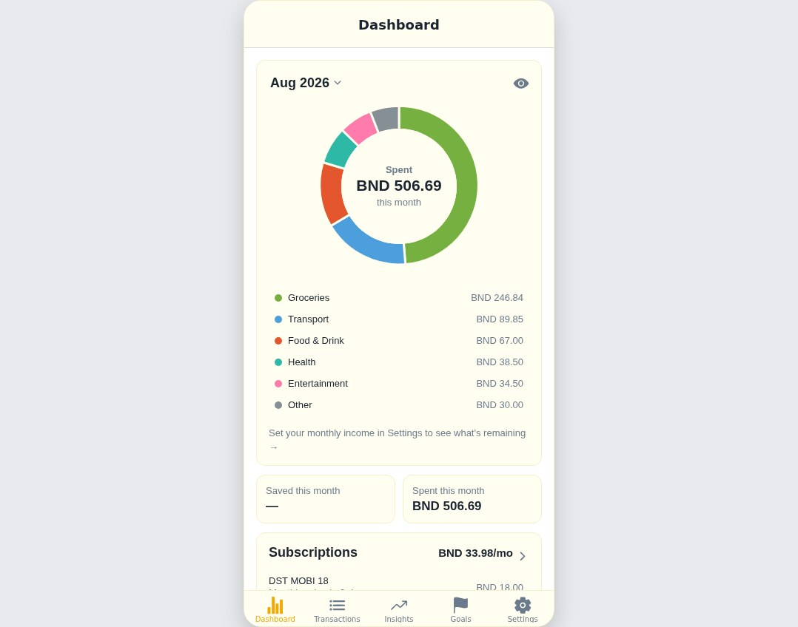
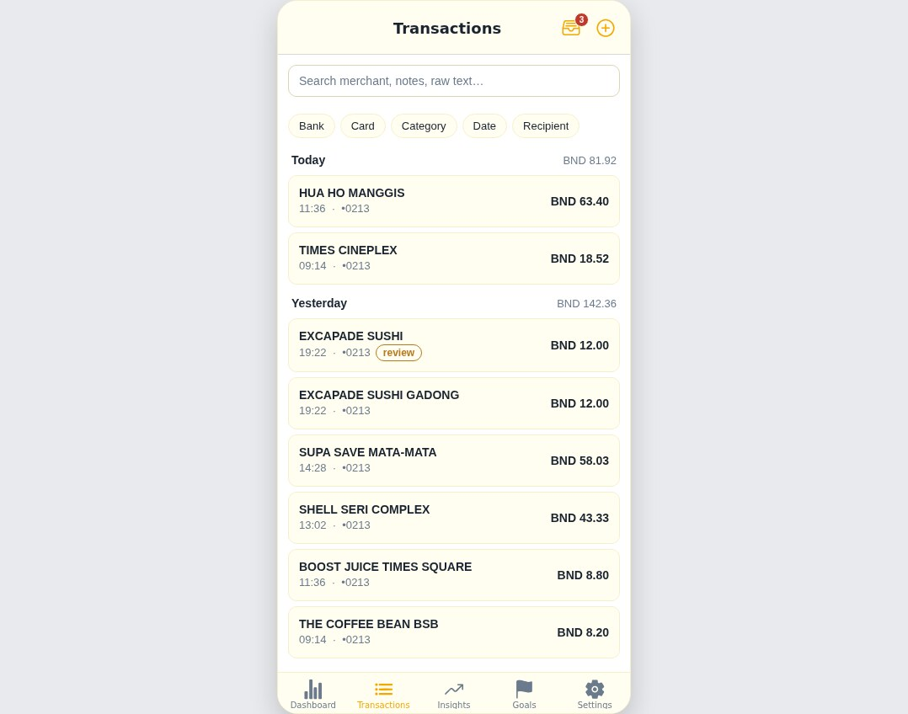
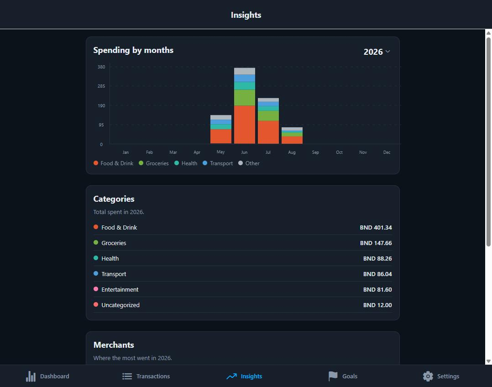

# Bukit Pennies

A spending tracker for Brunei that logs card transactions by reading the
notification text your bank already sends you.

**It never connects to a bank account.** No credentials, no open banking, no
scraping. The only thing it ever processes is a message that has already
arrived on your phone.

<p align="center">
  
  
  
</p>

*Screenshots use seeded demo data, not real spending.*

> **Try the live web demo:** `<your Netlify URL>` — the same app compiled for
> the browser against a hosted Supabase backend. Sign up and try it without an
> iPhone.

---

## Why it works this way

Brunei's banks have no open-banking API. The options were to ask people for
their bank credentials, or to use something they already receive: the SMS a
bank sends when a card is used.

That choice is the whole architecture. Everything downstream follows from it —
and so do its limits. There are no balances, no historical import, and no
record of a purchase the bank never messaged about. In exchange, using the app
requires trusting it with nothing.

## How it works

```
Bank SMS  →  iOS Shortcut  →  /ingest edge function  →  Postgres  →  app
             (automation)     parse · score · dedupe     (RLS)
```

1. An **iOS Shortcuts automation** fires when a message from the bank arrives and posts its text to a private endpoint.
2. The **ingest function** parses it — amount, merchant, date, card — and scores how sure it is.
3. Confident parses are stored as `parsed`. Anything doubtful goes to a **review queue** instead of being guessed at.
4. The **app** reads it back, row-scoped in the database so an account can only ever see its own data.

The raw message is kept forever, so a parser improvement can re-derive a
transaction that was originally read wrong.

## Architecture

TypeScript end to end — one zero-dependency parser package is shared between
the app and the server, so a message previews identically on the phone and on
the backend.

```
┌────────────────────────────── app ──────────────────────────────┐
│  Expo / React Native (iOS-first, also runs on web + Android)     │
│  expo-router  ·  TanStack Query  ·  @bukit/parsers              │
└───────────────────────────────┬─────────────────────────────────┘
                                │ RLS-scoped queries + security-checked RPCs
┌───────────────────────────────▼────────────────── Supabase ─────┐
│  Postgres — 25 migrations, RLS on every table                    │
│  Edge Functions (Deno) — ingest, parse, dedupe, rate-limit       │
│  Auth — email/password, SecureStore session                      │
└──────────────────────────────────────────────────────────────────┘
```

The parts full-stack hiring managers tend to care about live in the database
layer, not the UI:

- **Row Level Security on every table.** `transactions`, `budgets`, `goals`,
  and `subscriptions` are scoped to `auth.uid()`, so isolation holds even
  against a hand-written API call. See the RLS section of
  [`Things I learned`](#things-i-learned-building-it).
- **RPC-only write surface.** Transactions are written through
  security-checked functions — the client never builds its own `UPDATE` or
  `DELETE` against the table.
- **Views use `security_invoker`.** Without it a view runs as its owner and
  silently bypasses the RLS underneath. A subtle bug, fixed in migration 11.
- **Rate limits live in Postgres.** A serverless function has no memory
  between invocations, so the counter that survives is the one in the
  database (migration 12).
- **Token hygiene.** Ingest tokens are stored only as SHA-256 fingerprints;
  the plaintext is shown once and a database dump yields nothing usable.
- **CI.** Tests and typechecks run on every pull request, and a GitHub Actions
  macOS runner builds the unsigned iOS IPA.

## Stack

TypeScript throughout. **Expo / React Native** (iOS-first) · **Supabase** —
Postgres, Auth, Row Level Security, Deno edge functions · **Vitest** ·
**GitHub Actions**.

The parser is a zero-dependency package shared between the app and the server,
so a message previews identically on the phone and on the backend.

## Things I learned building it

**A constraint is a design tool.** "Never touch a bank account" wasn't a
technical decision, it was a trust one — and it determined the schema, the
ingest flow and the App Store story. Keeping `raw_text` forever came from the
same place: if a parser is wrong today, the message is still there to re-read
tomorrow. Had I stored only the extracted fields, a parser bug would have been
permanent data loss.

**Serverless functions don't remember anything.** Rate limiting was first
written as an in-memory sliding window. Supabase Edge Functions can give every
request a fresh isolate, so the counter was always empty — the limiter was
inert while appearing to work, and unit tests passed because a single test
process does share memory. The limits now live in Postgres, the one piece of
state that survives between invocations.
&nbsp;→ [`12_ingest_rate_limits.sql`](supabase/migrations/12_ingest_rate_limits.sql)

**No error is not the same as success.** PostgREST caps a response at 1,000
rows and says nothing about having done so. Queries that read a whole month or
year had no paging, so every total quietly understated once a window passed a
thousand transactions. Nothing failed; the numbers were just wrong. Paging also
has to impose a *total* order — rows tying on the sort column can swap between
requests, so you lose one and repeat another.
&nbsp;→ `fetchAllPages` in [`queries.ts`](apps/mobile/src/lib/queries.ts)

**Authorisation belongs in the database.** Every table has a Row Level Security
policy tying rows to the signed-in user, so isolation holds even against a
hand-written API call — it isn't a filter the client has to remember. Capture
tokens are shown once and stored only as a SHA-256 hash: the server compares
hashes, so a database dump yields nothing usable. The subtle part was views —
without `security_invoker`, a view runs as its owner and hands every user
everyone else's rows, bypassing the RLS underneath.
&nbsp;→ [`02_rls.sql`](supabase/migrations/02_rls.sql) ·
[`11_security_hardening.sql`](supabase/migrations/11_security_hardening.sql)

## Status and scope

Working: Baiduri and BIBD messages parse and log automatically on iOS; manual
entry; budgets; savings goals; subscriptions; CSV export; a review queue for
anything the parser is unsure of.

Deliberately not built:

- **Standard Chartered messages aren't parsed.** No real sample has been collected, so that parser is capped below the confidence threshold — SCB messages land in review rather than being guessed at.
- **Android capture isn't implemented.** iOS-first by choice; the app runs on Android but without automatic capture.
- **Not in the App Store.** It runs on my own phone, sideloaded.

## Running it locally

Requires Node 22+, pnpm 10, and Docker.

```bash
pnpm install
pnpm exec supabase start     # local Postgres, Auth and functions
pnpm --filter @bukit/mobile web
```

`pnpm -r test` runs the suite; `pnpm -r typecheck` type-checks every package.

Deeper docs: [architecture and decisions](docs/execution-playbook.md) ·
[user guide](docs/user-guide.md) ·
[hosted deploy](docs/hosted-supabase-deploy.md) ·
[privacy policy](docs/privacy-policy.md)

## A note on how it was built

This is a learning project as much as a working one, and I'd rather say that
plainly than have it inferred.

It was built with AI pair-programming (Claude Code). I set the product
direction, made the engineering decisions, reviewed every change and tested it
on real hardware — the code was largely AI-written under that direction. The
judgement calls are mine and I'll happily defend any of them: dropping an
unused table rather than leaving it dormant, cutting a dashboard banner because
a badge already carried the signal, and treating a back button that returned to
the wrong screen as evidence the navigation *structure* was wrong rather than
the button.

Alongside it I'm working through the codebase deliberately — a study plan that
goes layer by layer, from the zero-dependency parser package up through the
database, the edge function and the app, with the goal of being able to explain
and modify any part of it unaided. The four sections above are the parts I've
studied closely enough to defend under questioning; that is exactly why they
are the ones written down, and the list grows as I work through the rest.
