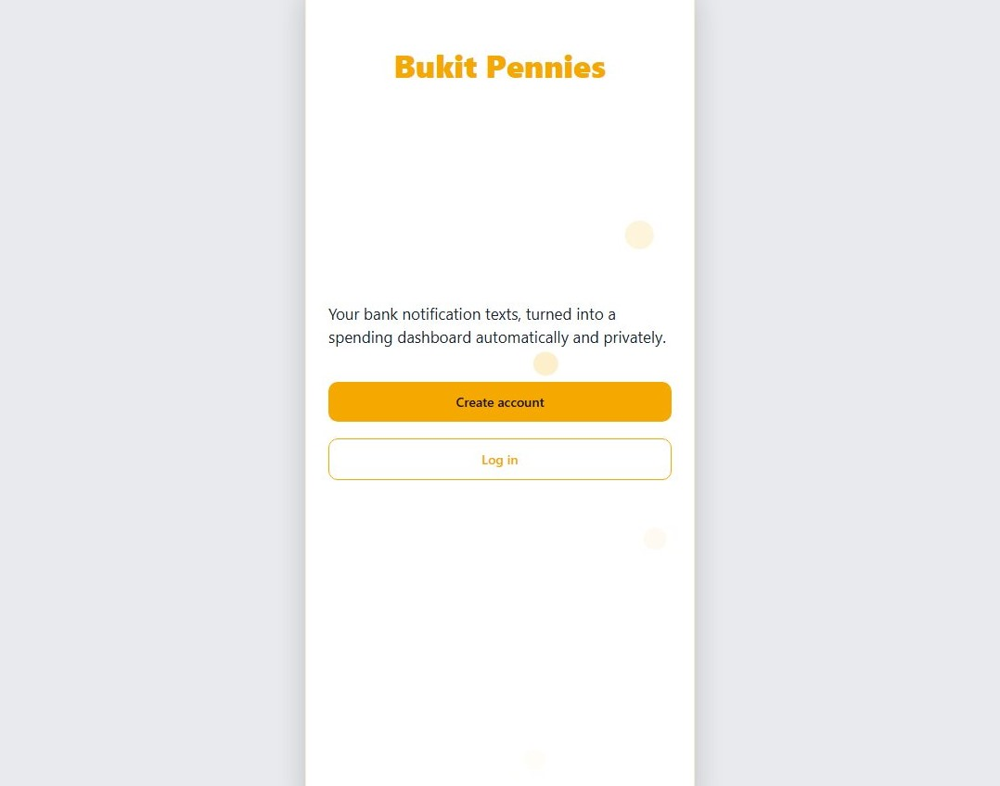

# Bukit Pennies

A spending tracker for Brunei that records card transactions by reading the notification text your bank already sends you.

I built this to track my own card spending, and learning the whole stack to do it meant wrong turns, rewritten code, and a working app on my phone at the end. If it helps other people too, it's an app I'd be proud to have built.

<p align="center">
  <a href="https://github.com/jaredoka/bukit-pennies/actions"></a>
  <a href="LICENSE"></a>
  <a href="https://bukit-pennies.netlify.app"></a>
</p>

**It never connects to a bank account.** No credentials, no open banking, no scraping. The only thing it ever processes is a message that has already arrived on your phone.

<p align="center">
  
  
  
  
</p>

*Screenshots use seeded demo data, not real spending.*

> **Try the live demo:** [bukit-pennies.netlify.app](https://bukit-pennies.netlify.app). A sample SMS is built in, so you can watch a transaction parse in a few seconds without an iPhone.

---

## Why it works this way

Brunei's banks have no open banking API. The realistic options were to ask for bank credentials or to use something people already receive: the SMS a bank sends when a card is used.

That choice drives the whole architecture, and its limits too. There are no balances, no historical import, and no record of a purchase the bank never messaged about. You trust it with a text message, never with a bank account.

## How it works

```
Bank SMS  →  iOS Shortcut  →  /ingest edge function  →  Postgres  →  app
             (automation)     parse · score · dedupe     (RLS)
```

1. An **iOS Shortcuts automation** fires when a message from the bank arrives and posts its text to a private endpoint.
2. The **ingest function** parses it (amount, merchant, date, card) and scores how confident it is.
3. Confident parses are stored as `parsed`. Anything doubtful goes to a **review queue** instead of being guessed at.
4. The **app** reads it back, scoped by row in the database so an account can only ever see its own data.

The raw message is kept forever, so a parser improvement can reprocess a transaction that was originally read wrong.

## Architecture

TypeScript end to end. One zero dependency parser package is shared between the app and the server, so a message previews identically on the phone and on the backend. The app is Expo / React Native (iOS first, also runs on web and Android); the backend is Supabase (Postgres, Auth, Row Level Security, Deno edge functions); tests run on Vitest and CI on GitHub Actions.

```
┌────────────────────────────── app ──────────────────────────────┐
│  Expo / React Native (iOS-first, also runs on web + Android)     │
│  expo-router  ·  TanStack Query  ·  @bukit/parsers              │
└───────────────────────────────┬─────────────────────────────────┘
                                │ RLS-scoped queries + security-checked RPCs
┌───────────────────────────────▼────────────────── Supabase ─────┐
│  Postgres — 25 migrations, RLS on every table                    │
│  Edge Functions (Deno) — ingest, parse, dedupe, rate-limit       │
│  Auth — email/password, SecureStore session                      │
└──────────────────────────────────────────────────────────────────┘
```

The most interesting work is in the database layer, not the UI:

- **Row Level Security on every table.** `transactions`, `budgets`, `goals`, and `subscriptions` are scoped to `auth.uid()`, so isolation holds even against a hand written API call. See the RLS section of [Things I learned](#things-i-learned-building-it).
- **Writes go through RPCs.** Transactions are written through security checked functions; the client never builds its own `UPDATE` or `DELETE` against a table.
- **Views use `security_invoker`.** Without it a view runs as its owner and silently bypasses the RLS underneath. A subtle bug, fixed in migration 11.
- **Rate limits live in Postgres.** A serverless function has no memory between invocations, so the counter that survives is the one in the database (migration 12).
- **Token hygiene.** Ingest tokens are stored only as SHA-256 fingerprints; the plaintext is shown once, and a database dump yields nothing usable.
- **CI.** Tests and typechecks run on every pull request, and a GitHub Actions macOS runner builds the unsigned iOS IPA.

## Things I learned building it

**Authorisation lives in the database, not in the client.** Every table has a Row Level Security policy scoped to `auth.uid()`, so even a hand-written API call cannot cross accounts, and writes go through a few security-checked RPCs rather than the client building its own `UPDATE` or `DELETE`. The subtle one is views: without `security_invoker`, a view runs as its owner and silently serves everyone everyone else's rows. Three security passes later, each one found the same shape of bug — a rule the app stated but the database did not enforce: text columns with no length bound, an endpoint with no quota, a session that survived a password reset. Code can be worked around; a constraint in Postgres cannot ([`02_rls.sql`](supabase/migrations/02_rls.sql), [`11_security_hardening.sql`](supabase/migrations/11_security_hardening.sql), [`20_input_bounds_and_quotas.sql`](supabase/migrations/20_input_bounds_and_quotas.sql)).

**One parser, three runtimes.** The highest-risk logic in the app — turning a bank SMS into a transaction — is a single zero-dependency TypeScript package, imported by the mobile app (offline preview), the edge function (the authoritative parse) and the test suite, so a message previews identically everywhere. Adding a new bank format is one module plus one golden fixture of a real message. The raw text is kept forever, so a parser improvement can redo a transaction that was originally read wrong ([`packages/parsers/src/index.ts`](packages/parsers/src/index.ts)).

**Serverless functions have no memory between calls.** My first rate limiter was an in-memory sliding window, and it passed every unit test because a single test process does share memory. Supabase Edge Functions give each request a fresh isolate, so in production the counter was always empty and the limit never fired. The limits now live in Postgres, where the state actually survives — and the database has the side benefit that a hand-written API call cannot get around them ([`12_ingest_rate_limits.sql`](supabase/migrations/12_ingest_rate_limits.sql)).

**Design for testability from the start.** UI and device code cannot run in a Node test, so the pure logic is split into its own modules — filters, CSV quoting, subscriptions, calendar arithmetic — each with real tests. One test guards the whole app: a list of every storage key the app builds, asserted against the characters the platform's key store actually accepts. It caught the bug no amount of web development could reproduce, because the browser accepts keys the phone silently rejects ([`txFilters.ts`](apps/mobile/src/lib/txFilters.ts), [`kvStore.test.ts`](apps/mobile/test/kvStore.test.ts)).

**The review queue is the data engine, not a fallback.** Anything the parser is not sure of lands in a review inbox instead of being guessed at — and that inbox doubles as the collection loop for bank formats I do not have yet. BIBD's parser went from a skeleton to verified the day a real message arrived; Standard Chartered's stays capped below the confidence threshold until a real sample exists. You collect the data before you trust the model ([`packages/parsers/test/golden/`](packages/parsers/test/golden/)).

**Friction, not features, is what loses users.** The hard part of the product was never parsing a message; it was getting the message into the app. Setup meant building an iOS automation, and the step people abandoned is the one that has to happen inside another app. I could see the drop-off from the database alone — accounts created, versus capture tokens created, versus tokens that ever logged a transaction. The setup flow went from an enforced gate to an optional, resumable prompt, and the numbers are what will tell me whether it worked.

## Status and scope

**Working**
- [x] Baiduri and BIBD capture on iOS — messages parse and log automatically
- [x] Manual entry, budgets, savings goals, subscriptions, CSV export
- [x] A review queue for anything the parser isn't sure of

**Next up**
- [ ] Standard Chartered parsing — capped below the confidence threshold until a real message arrives; a redacted screenshot would fix it
- [ ] Android capture — planned after the iOS release
- [ ] App Store release — in progress; currently sideloaded on my own phone

**Deliberately not built**
- Bank aggregation. No balances, no imports, no connection to a bank account — by design, and why the app only ever sees a text message.

## Running it locally

Requires Node 22+, pnpm 10, and Docker.

```bash
pnpm install
pnpm exec supabase start     # local Postgres, Auth and functions
pnpm --filter @bukit/mobile web
```

`pnpm -r test` runs the suite; `pnpm -r typecheck` checks types across every package.

Deeper docs: [architecture and decisions](docs/architecture-and-decisions.md) ·
[user guide](docs/user-guide.md) ·
[hosted deploy](docs/hosted-supabase-deploy.md) ·
[privacy policy](docs/privacy-policy.md)

Contributions are welcome; [CONTRIBUTING.md](CONTRIBUTING.md) explains the
conventions (parser golden fixtures, GitHub Flow, RLS rules).

## How it was built

I want to be honest about this: the code was written with Claude Code, an AI pair programmer. I set the product direction, made the engineering decisions, reviewed every change, and tested it on real hardware. The judgement calls are mine and I can explain any of them: dropping an unused table rather than leaving it dormant, cutting a dashboard banner because a badge already carried the same signal, and treating a back button that returned to the wrong screen as evidence the navigation structure was wrong rather than the button.

Alongside the project I am working through the codebase deliberately, layer by layer, from the zero dependency parser package up through the database, the edge function and the app. The goal is to be able to explain and modify any part of it unaided. The sections above are the parts I have studied closely enough to defend under questioning; that is exactly why they are written down, and the list grows as I keep going.

## Maintained by

[jaredoka](https://github.com/jaredoka) · [MIT licensed](LICENSE)
